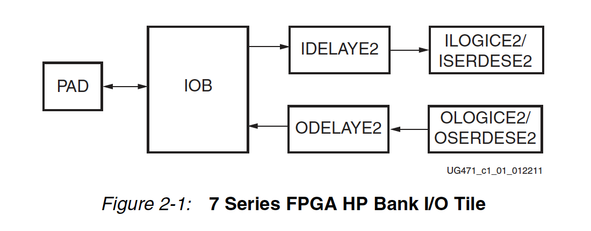

# About Xilinx

## Design Hubs

- [__UG888__: Vivado Design Suite Tutorial: Design Flows Overview](https://www.xilinx.com/support/documentation/sw_manuals/xilinx2018_3/ug888-vivado-design-flows-overview-tutorial.pdf)
- [__UG949__: UltraFast Design Methodology Guide for the Vivado Design Suite](https://www.xilinx.com/content/dam/xilinx/support/documentation/sw_manuals/xilinx2018_3/ug949-vivado-design-methodology.pdf)
	- A very good entry level introduction to overall design flow considerations.
- [__UG1231__: UltraFast Design Methodology Quick Reference Guide](https://www.xilinx.com/support/documentation/sw_manuals/xilinx2018_3/ug1231-ultrafast-design-methodology-quick-reference.pdf)
- [__UG1197__: UltraFast High-Level Productivity Design Methodology Guide]()
		- Concepts about FPGA shell, HLS, and IP integration. Very useful.
		- The two key principles to keep in mind when reviewing the code for implementation in an FPGA are:
			- An FPGA is a fixed size resource. The functionality must be fixed at compile time. Objects in hardware cannot be dynamically created and destroyed.
			- All communication with the FPGA must be performed through the input and output ports. There is no underlying Operating System (OS) or OS resources in an FPGA.

## HLS

- The arXiv book
- [The Zynq book](http://www.zynqbook.com/) Chapter 15 is great, take a careful read.
- [Vivado Design Hub - High-Level Synthesis (C based)](https://www.xilinx.com/support/documentation-navigation/design-hubs/dh0012-vivado-high-level-synthesis-hub.html)
- `UG998: Introduction to FPGA Design with Vivado High-Level Synthesis`
- `UG871: Tutorial High-Level Synthesis`
	- Lab: great way to start coding HLS
- `UG902: User Guide High-Level Synthesis`
	- [Properly Defining Interfaces in High-Level Synthesis](https://www.xilinx.com/support/documentation/sw_manuals/xilinx2018_3/ug902-vivado-high-level-synthesis.pdf#nameddest=InterfaceSynthesis)
	- __Chapter 3 HLS Libraries__
		- There are many useful library functions and IPs, including MATH, SHA, FFT. Check this when we need something.
		- HLS Stream
		- HLS Arbitrary Precision
	- __Chapter 4: Coding Styles__ _MUST READ_
		- Explains how C, C++ are compliled into FPGA.
		- Many C/C++ libraries are NOT supported
		- Inline function works as usual
		- Loops
			- Variable loop bounds: trick is using maximum + conditional check within loop.
			- Pipeline: innermost, or out loops.
			- Parallelism: make two independent loops sub functions, or use `dataflow`
			- Reduce loop dependencies
		- Array
        		- Arrays implemented as memory or memory ports can often become bottlenecks to performance.
- `UG1197: UltraFast High-Level Productivity Design Methodology Guide`
- ** `XAPP1209: Designing Protocol Processing Systems with Vivado High-Level Synthesis`
- `XAPP1273: Reed-Solomon Erasure Codec Design Using Vivado High-Level Synthesis Application Note`
- `Data I/O protocols`: those are directives that control how the input/output signals interact with outside users.
- `Block-level I/O protocols`: this allows the RTL design to be controlled by additional ports independently of the data I/O ports.

## About 7 series FPGA

- `UG470 Configuration`
	- About how download bitstream into FPGA and how to configure FPGA
	- JTAG, Flash, Master, Slave
	- Fun fact: bitstream length is fixed no matter how much resource is consumed by your code. ;-)
- `UG471 SelectIO`
	- This UG first talks about the electrical behavior of `output drivers` and `input receivers`, and gives detailed examples of many standard interfaces. And then it explains all the `supporting logics` for IO, e.g. ILOGIC, IDELAY. This UG has everything you need to know about Xilinx IO pins, and how the IO pins is organized in the FPGA chip.
	- Each I/O bank contains 50 SelectIO pins
	- `I/O Standards`
		- Single-ended I/O standards (e.g., LVCMOS, LVTTL, HSTL, PCI, and SSTL)
		- Differential I/O standards (e.g., LVDS, Mini_LVDS, RSDS, PPDS, BLVDS, and differential HSTL and SSTL)
	- `SelectIO Primitives` (IBUF, IBUFG, IBUFDS, OBUF, OBUFT etc). (Signals used as inputs to 7 series devices must use an input buffer (IBUF, or other different flavors). Some buffers, e.g., IBUF, will be inserted by Vivado automatically during synthesis. Some buffers. e.g., IBUFDS, must be initialized manually via Verilog code (check UG768).)
	- `SelectIO Attributes/Constraints` (You can see these on `I/O Ports` tab on Vivado. And you can modify these through xdc file.)
		- Location Constraints
		- IOSTANDARD Attribute
		- IBUF_LOW_PWR Attribute
		- Output Slew Rate Attributes (SLOW or FAST)
		- Output Drive Strength Attributes
		- PULLUP/PULLDOWN/KEEPER Attribute for IBUF, OBUFT, and IOBUF
	- `Rules for Combining I/O Standards in the Same Bank`
		- TODO: Looks like there many things to consider when we do I/O pin planning. For example, we need to consider voltage, noisy neighbours issues. Maybe Vivado will complain if we do something wrong?
	- __FAT QUESTION__ Why primitives? Primitives (IBUF, OBUF etc) are used by Xilinx to support different I/O standards. What does this mean? 1) First understand what's the benefit of buffer. Buffer is used to isolate two worlds that may have different voltage, frequency etc. 2) Different I/O standard have very different physical behavior, e.g. they have different voltage. Those primitives, or those buffers, are used to connect different I/O standards to FPGA logic. Those primitives can be configured in so many different ways to accommodate different I/O standards (LVCMOS33, LVCMOS25 etc). And that's why IO has Attributes/Constraints. Those primitives are really the first thing to think about we are going to build IO. And you will see them very frequently.
	- Chapter 2: `SelectIO Logic Resource`: the __logic__ directly behind the I/O drivers and receivers. Note that, now we are talking about logic. Previously we are focusing on `IO Buffer Primitives` that are used to support different IO standards. But now we shift our attention to logic, which can do many interesting things.
		- 
		- `I/O tile`: the whole IO thing is quite complex because the IO pin needs to support so many stuff. So the IO block is surrounded by many other logics, to support many IO standards and attributes. An I/O tile includes: PAD, IO block, IDELAY, ILOGIC, OLOGIC, ODELAY. It's a whole package.
		- `ILOGIC`: The ILOGIC block is located next to the I/O block (IOB). The ILOGIC block contains the synchronous elements for capturing data as it comes into the FPGA through the IOB. ILOGIC is like predefined logic that will manipulate all incoming signals. As its name, ILOGIC is used to implement _some_ logic, it can be used to implement NO-OP (combinatorial) and DDR. Good to know.
		- `IDELAY`: IDELAY allows incoming signals to be delayed on an individual input pin basis. It can be applied to the combinatorial input path, registered input path, or both. It can also be accessed directly from the FPGA logic. IDELAY is also a small block module. It's programmable, it has its own input/output signals.
		- `OLOGIC: The OLOGIC block is located next to the I/O block (IOB). OLOGIC is a dedicated synchronous block sending data out of the FPGA through the IOB. OLOGIC consists of two major blocks, one to configure the output data path and the other to configure the 3-state control path.
		- `ODELAY`: similar to IDELAY.
		- `ISERDESE2` and `OSERDESE`: Something we need to learn in the future?
		- `IO_FIFO`: how can we use this? and how this is different from LUT FIFO, user FIFO?
	- In Vivado, open `Implementation -> Device` and `Floorplanning`. Zoom in to the edges of the device. You should be able to see those IOB (PAD, IBUF, OBUF), and those ILOGIC, OLOGIC blocks. Some of them might be assigned to some top-level ports, as described by your xdc file. So, looks like most of those BUFs and LOGICs are inserted by Vivado!
	- Hmm, those IO blocks and logics, they are actually specialized "hard" logic in FPGA. They CAN be all implemented by using LUT. But to improve performance, just like DSP block did, we have those specialized IO blocks or IO tiles. Same for the following clock PLL and MMCM blocks.
- `UG472 Clocking`
	- Most of the thing we need to know about clock. This UG first talks about the available clocking resources, such as buffers, nets. And then it describes PLL and MMCM. After reading this, you will understand how clock is wired, distributed across whole FPGA. In `Device` view, those PLL and MMCM are sitting right next to SelectIO resources, near the edge.
	- MMCM, PLL reference guide
	- Selecting the proper clocking resources can improve routeability, performance, and general FPGA resource utilization.
	- Clock-cable Inputs (MRCC, SRCC)
	- Global Clocking Resource
		- Clock Tree and Nets - GCLK
		- Clock Regions
		- Global Clock Buffers
- UG473 Memory Resources
	- TODO
- UG474 Configurable Logic Block. About LUT and organization
- UG475 Packaging and Pinout
	- Chapter 3 device diagram shows I/O planning symbols
- UG479 DSP48E1 Slice
	- TODO
- UG483 PCB Design Guide
	- For fun
- UG768 FPGA Libraries Guide for HDL Designs
- UG953 Vivado Design Suite 7 Series FPGA and Zynq-7000 SoC Libraries Guide
	- TODO

## Memory

This section includes resources related to `on-chip and on-board memory`, including but not limited to on-board DRAM, on-chip BRAM, registers, and so on. Usually, we first learn how to use BRAM and registers, and then learn how to use on-board DRAM. If you have background on how Memory Controller, good, you may catch up quickly. If you don't, don't worry, do a skim read on `UG586` and `PG150` to get a basic sense.

Following are some generic links on this topic I found useful:

- Xilinx's white paper [WP377: Xilinx 7 Series FPGAs Embedded Memory Advantages](https://www.xilinx.com/support/documentation/white_papers/wp377_7Series_Embed_Mem_Advantages.pdf) is nice introduction.
- [This post](https://forums.xilinx.com/t5/Vivado-High-Level-Synthesis-HLS/Memory-Structures-in-Vivado-HLS-a-new-documentation/td-p/769986) talks about 6 different memories available at UltraScale.

### On-board DRAM

- [URL: Xilinx Memory Interface](https://www.xilinx.com/products/intellectual-property/mig.html)
- __`DS176` and `UG586`: Zynq-7000 SoC and 7 Series Devices Memory Interface Solutions__
	- Memory Interface Solutions (MIS) core is a combined pre-engineered controller and physical layer (PHY) for interfacing 7 series FPGA user designs and AXI4 slave interfaces to DDR3 and DDR2 SDRAM devices.
	- Checkout Chapter 1's Core Architecture. A very informative diagram (Figure 1-51).
	- `Figure 1-53` Memory Controller
	- `Figure 1-56` PHY Block Diagram
	- `Figure 1-72` and `Figure 1-73` show how to control the mapping between address and Rank/Row/Bank/Column. I've been thinking doing this for a long time, but it's hard to do this on Intel's MC.
- __`PG150`: UltraScale FPGA Memory IP__
	- Figure 3-1 shows the Memory Interface diagram, including 1) User FPGA logic, 2) Memory Controller, 3) Physical Layer, 4) DDR3/DDR4.
	- It also talks about what optimizations are available within MC. Such as Read/Write Coalescing, Reordering.
	- `PHY`: __1)__ PHY is considered the low-level physical interface to an external DDR3 or DDR4 SDRAM device as well as all calibration logic for ensuring reliable operation of the physical interface itself. PHY generates the signal timing and sequencing required to interface to the memory device. PHY have interface singals that talks with DRAM dircetly. Those interfaces are defined by the JEDEC specification. __2)__ The PHY interface takes DRAM commands, like Activate, Precharge, Refresh, etc. at its input ports and issues them directly to the DRAM bus.
- __`XAPP739`: AXI Multi-Ported Memory Controller__

### Block RAM (BRAM)

General documents about BRAM

- __`PG048`: Block Memory Generator v8.4 LogiCORE__
	- I don't think we need to configure this IP during at normal cases. Vivado and HLS will help us integrate necessary BRAM blocks.
- __`UG473`: 7 Series FPGAs Memory Resources__
	- This document describes the block RAM resource.
	- BRAM has two ports, A and B. They can be accessed at the same time. Synchronization has to be carried out by user if the same location is accessed by two ports at the same time.
	- Primitives: `RAMB18E1` and `RAMB36E1`. Just like those MMCM and PLL primitives. Check 7 series libraries guide.
	- __Chapter 2: Built-in FIFO Support__. Definitely check out this.
		- Many FPGA designs use BRAM to implement FIFO. So Xilinx decides to add dedicated logic in the block RAM enables you to implement synchronous or dual-clock (asynchronous) FIFO. This eliminates the need for additional CLB logic for counter, comparator, or status flag generation, and uses just one block RAM resource per FIFO. Both standard and first-word fall-through (FWFT) modes are supported.
		- This built-in FIFO is another _hard_ resource in FPGA, like DSP.
		- This built-in FIFO _may_ be used by [PG057 FIFO Generator](https://www.xilinx.com/products/intellectual-property/fifo_generator.html) to create FIFO. PG057 noted: the Native interface FIFO can be customized to utilize `block RAM`, `distributed RAM` or __`built-in FIFO`__ resources available in some FPGA families to create high-performance, area-optimized FPGA designs.

Use BRAM in HLS

- TODO

### Distributed Memory

- `UG474: 7 series CLB`: The LUTs in SLICEMs can be implemented as a synchronous RAM resource called a distributed RAM element. Compared to BRAM, Distributed Memory is very fine grained in terms of size.
- __`PG063`: Distributed Memory Generator v8.0 LogiCORE__

Use Distributed Memory in HLS

- TODO

### Shift Registers

- `UG474: 7 series CLB`: A SLICEM function generator can also be configured as a 32-bit shift register without using
the flip-flops available in a slice. Used in this way, each LUT can delay serial data from 1 to
32 clock cycles.
- Shift registers are very similar to Distributed Memory, in the sense that they both utilize unused LUTs.
- __`XAPP793`: Implementing Memory Structures for Video Processing in the Vivado HLS Tool__
	- Shift registers
	- Memory windows
	- Line buffers

Use Distributed Memory in HLS

- TODO

### Memory Misc

- UG057 FIFO Generator
	- The FIFO Generator core implements FIFOs built from block RAM, distributed RAM, shift registers, or built-in FIFOs. The core combines memory primitives in an optimal configuration based on the selected width and depth of the FIFO.
	- ...  The Built-In FIFO __solutions__ are implemented to take advantage of logic internal to the Built-in FIFO `macro`. Several features, for example, almost full, almost empty, and so forth were not implemented because they are not native to the macro and require additional logic in the logic to implement.
	- AXI: Pay attention to the `Packet FIFO`

## Constraints

- Check `xilinx_constraints.md`

## Configurable Logic Block (CLB)

- UG474: 7 Series FPGAs Configurable Logic Block: gives a very good introduction about how LUT is organized in Xilinx

## Buffer

- (Q: why IOBUF? why clock buffer? why there is an awkward buffer in the middle?)
- [URL: Digital Buffer Tutorial](https://www.electronics-tutorials.ws/logic/logic_9.html)
- [URL: Buffer Gate](https://en.wikichip.org/wiki/buffer_gate)
- [Wiki: Digital buffer](https://en.wikipedia.org/wiki/Digital_buffer)
- [Wiki: Buffer amplifier](https://en.wikipedia.org/wiki/Buffer_amplifier)
- [StackExchange: What is the purpose of a buffer gate?](https://electronics.stackexchange.com/questions/236666/what-is-the-purpose-of-a-buffer-gate)

## IO

- [Vivado Design Hub - I/O and Clock Planning](https://www.xilinx.com/support/documentation-navigation/design-hubs/dh0007-vivado-pin-planning-hub.html)
- [UG899 Vivado I/O and Clock Planning](https://www.xilinx.com/support/documentation/sw_manuals/xilinx2018_3/ug899-vivado-io-clock-planning.pdf)
- HP: high-performance IO banks
- HR: high-range IO banks
	- The HP I/O banks are designed to meet the performance requirements of high-speed memory and other chip-to-chip interfaces with voltages up to 1.8V. The HR I/O banks are designed to support a wider range of I/O standards with voltages up to 3.3V.
- IDELAY allows incoming signals to be delayed on an individual input pin basis
- IO Buffers
	- `IBUF`: is automatically inserted (inferred) by the synthesis tool to any signal directly connected to a top-level input or in-out port of the design. (UG768: Xilinx 7 Series FPGA Libraries Guide for HDL Designs)
	- `IBUFDS`: is NOT inserted (inferred) by the synthesis tool, you have to manually write code to instantiation. In IBUFDS, a design level interface signal is represented as two distinct ports (I and IB), one deemed the "master" and the other the "slave." The master and the slave are opposite phases of the same logical signal. (Leant this from tri-mode reference code)
- Each top-level port is within the scope of SelectIO. We can use constraints to define what IO standard, what package pin, what drive length etc our top-level ports want. The whole thing is described as SelectIO by Xilinx. We should check each series's SelectIO guide to know what IO standards our FPGA support. SelectIO will also automatically add IO buffers into our design, such as IBUF, OBUF.

## Clock

- [Vivado Design Hub - I/O and Clock Planning](https://www.xilinx.com/support/documentation-navigation/design-hubs/dh0007-vivado-pin-planning-hub.html)
- [UG899 Vivado I/O and Clock Planning](https://www.xilinx.com/support/documentation/sw_manuals/xilinx2018_3/ug899-vivado-io-clock-planning.pdf)
- [Slides: Clocks Basics in 10 Minutes or Less](http://www.ti.com/ww/mx/multimedia/webcasts/TI_webinar_25-06-2010.pdf)
- [Slides: Clock Tree 101](http://www.mouser.com/pdfdocs/clock-tree-101-timing-basics.pdf)
- [Slides: FPGA IO Resources](https://wiki.dcae.pub.ro/images/b/bd/FPGA_SERDES.pdf)
- [URL: Differential versus Single-ended Clocks](https://www.silabs.com/community/timing/knowledge-base.entry.html/2012/12/17/differential_versus-wMdt)
- [Wiki: Frequency synthesizer](https://en.wikipedia.org/wiki/Frequency_synthesizer)
	- A frequency synthesizer is an electronic circuit that generates a range of frequencies from a single reference frequency.
- [URL: NI PXIe-796xR Base Clocks](http://zone.ni.com/reference/en-XX/help/372614J-01/target5devicehelp/pxie_base_clocks/)
	- shows how Oscillator is connected to FPGA, and how PLL
	generates multiple clocks.
- [URL: Clock Signal Management: Clock Resources of FPGAs](https://www.allaboutcircuits.com/technical-articles/clock-management-clock-resources-of-fpgas/)
	- Nice into about PLL and DLL
	- Global clocks, regional clocks
	- [H Tree](https://en.wikipedia.org/wiki/H_tree)
- [URL: FPGA Clock Schemes](https://www.embedded.com/design/configurable-systems/4024526/FPGA-Clock-Schemes)
- [URL: Programmable Logic Design FPGA clocking schemes](http://www.ue.pwr.wroc.pl/pld/pld_10.pdf)
- [Xilinx Clock Generator IP (v4.03a)](https://www.xilinx.com/support/documentation/ip_documentation/clock_generator/v4_03_a/clock_generator.pdf)
- Clock Wizard IP
	- I suspect this is just a wrapper around CMT (MMCM and PLL).
- UG903 Ch.3 Defining Clocks
	- Primary clocks
	- Virtual clocks
	- Generated clocks
	- .. and many other stuff
- UG472 7 Series FPGAs Clocking Resources
	- Clocking architecture about series 7. Must read.
	- Ch.3: In 7 series FPGAs, the clock management tile (CMT) includes a mixed-mode clock manager (MMCM) and a phase-locked loop (PLL). The PLL contains a subset of the MMCM functions.
- `MMCME2_BASE`, `MMCME2_ADV`, `PLLE2_BASE`, `PLLE2_ADV`: Check UG472 ch.3 and UG768 for details. These are used to manipulate clocks, and I believe this is the building block of clock wizard. I encountered one MMCME2_ADV in tri-mode mac reference design.
- [`XAPPP888: MMCM and PLL Dynamic Reconfiguration`](https://www.xilinx.com/support/documentation/application_notes/xapp888_7Series_DynamicRecon.pdf)

## [What's `Implementation` in Xilinx?](https://www.xilinx.com/support/documentation/sw_manuals/xilinx11/ise_c_implement_fpga_design.htm)

- Xilinx Implementation happens after Synthesis, so it must include several important steps
	- Logic Optimization (which is `Translate` here). This step will take `constraints` into account.
	- Technology Mapping (which is `Map` here). This step map to FPGA logic islands, IOB, BRAM, etc.
	- Place and Route
- Overall, we don't need to fully understand what each step is doing, just need to get a basic sense.

## What is `.xdc`?

- [Vivado Design Hub - Applying Design Constraints](https://www.xilinx.com/support/documentation-navigation/design-hubs/dh0004-vivado-applying-design-constraints-hub.html)
- [Using Constraints v2017](https://www.xilinx.com/support/documentation/sw_manuals/xilinx2017_4/ug903-vivado-using-constraints.pdf)
- By default, all XDC files and Tcl scripts added to a constraint set are used for both synthesis and implementation. Set the `USED_IN_SYNTHESIS` and `USED_IN_IMPLEMENTATION` properties on the XDC file or the Tcl script to change this behavior.
- Timing Constrains
- Placement Constrains
- Synthesis Constrains

## [Floorplanning](https://en.wikipedia.org/wiki/Floorplan_(microelectronics))

- allows to place blocks of logic in an FPGA device, to reduce route delays for certain logics.
- [Floorplanning Methodology Guide](https://www.xilinx.com/support/documentation/sw_manuals/xilinx14_5/Floorplanning_Methodology_Guide.pdf)
- [Design Rule Checking (DRC) Messages](https://www.xilinx.com/support/documentation/sw_manuals/xilinx10/isehelp/pfp_r_drc_messages.htm)

- [External port](https://www.xilinx.com/support/documentation/sw_manuals/xilinx11/platform_studio/ps_p_hdw_making_external_port_connects.htm)

## AXI, AXI-Lite, and AXI-S. __How to connect IPs?__

- I came to this question when I tried to build blocks in HLS and Verilog, and was thinking about how should I connect those blocks? There are so many clk, reset, valid signal combinations, is there a standard for this communication protocol? Indeed, there are. This thread collects information about this topic.
- [Some basic knowledge](http://que.no/index.php/2016/03/13/principles-of-fpga-ip-interconnect/)
- [Introduction to AXI Protocol: Understanding the AXI interface](https://community.arm.com/soc/b/blog/posts/introduction-to-axi-protocol-understanding-the-axi-interface)
- [Xilinx AXI4, AXI-Lite, AXI-Stream Homepage](https://www.xilinx.com/products/intellectual-property/axi.html#details)
- AMBA® 4 AXI4-Stream Protocol
	- The AXI4-Stream protocol requires that all transfers remain __ordered__. It does not permit the reordering of transfers.
	- __AXI4-Stream removes the requirement for an address phase altogether and allows unlimited data burst size. AXI4-Stream interfaces and transfers do not have address phases and are therefore not considered to be memory-mapped.__
- Summary:
	- AXI4 has many channels, each channel has its own TVALID,
	TREADY and more. AXI-Lite is a subset of AXI4. AXI-stream is more
	simpilifed, in the sense that it actually only has one channel, which
	means only one TVALID, TREADY signals. AXI-stream is unidirectional
	between master and slave.
	- Like the tri-mode MAC, it is using AXI-stream for both TX and
	RX path. That means, if I want to build a new IP block to talk
	with MAC, my new IP only needs to conform with AXI-stream
	protocol.
- Just a side, MII is the interconnect protocol specifically between MAC and PHY.
- `UG1037: AXI Reference`.
- `PG035: AXI4-Stream Interconnect`.
- `PG085 AXI4-Stream Infrastructure IP Suite`.

## IP

- [Ethernet](https://www.xilinx.com/products/technology/ethernet.html)
	- [Tri-Mode Ethernet MAC](https://www.xilinx.com/products/intellectual-property/temac.html)
	- [AXI 1G/2.5G Ethernet](https://www.xilinx.com/products/intellectual-property/axi_ethernet.html#documentation)
	- [AXI Ethernet LITE](https://www.xilinx.com/products/intellectual-property/axi_ethernetlite.html)
	- [10G MAC](https://www.xilinx.com/products/intellectual-property/do-di-10gemac.html#documentation)
- [Clock Wizard](https://www.xilinx.com/products/intellectual-property/clocking_wizard.html#documentation)
- [Memory Interface](https://www.xilinx.com/products/intellectual-property/mig.html)
